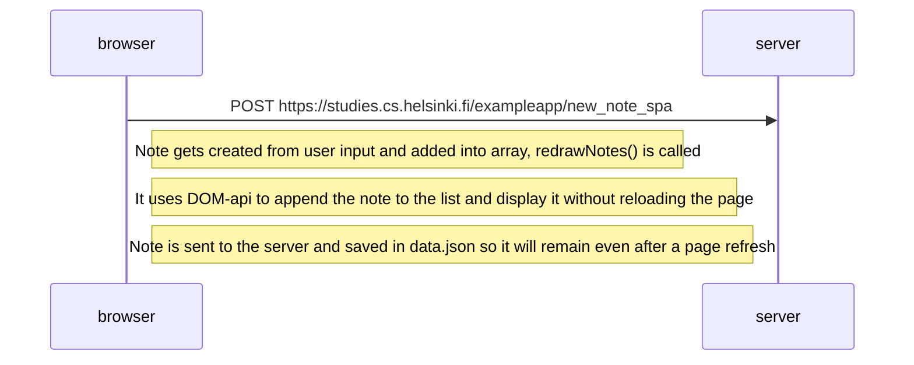

```mermaid
sequenceDiagram
    participant browser
    participant server
    
    browser->>server: POST https://studies.cs.helsinki.fi/exampleapp/new_note_spa
    note right of browser: Note gets created from user input and added into array, redrawNotes() is called
    note right of browser: It uses DOM-api to append the note to the list and display it without reloading the page
    note right of browser: Note is sent to the server and saved in data.json so it will remain even after a page refresh

    activate server
```
